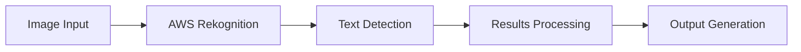

# AWS Rekognition Text Detection System 📷✨

[](https://aws.amazon.com/rekognition/)
[](https://www.python.org/)
[](https://boto3.amazonaws.com/v1/documentation/api/latest/index.html)
[](https://opensource.org/licenses/MIT)

## 🎯 Overview
A robust text detection system leveraging AWS Rekognition to extract text from images with high accuracy. Perfect for automating document processing, OCR tasks, and text-based image analysis.

### 🌟 Key Features
- **Advanced OCR**: Extract text from images with high precision
- **Multi-format Support**: Works with various image formats
- **Location Detection**: Identifies text placement in images
- **Confidence Scoring**: Provides accuracy metrics
- **AWS Integration**: Seamless cloud service integration

## 🏗️ Architecture


## 💻 Installation

### Prerequisites
- AWS Account
- Python 3.7+
- AWS CLI configured
- Required permissions for Rekognition

### Setup
```bash
# Clone repository
git clone https://github.com/AShirsat96/Amazon_Rekognition_Detect_Text_In_Image.git
cd Amazon_Rekognition_Detect_Text_In_Image

# Install dependencies
pip install -r requirements.txt

# Configure AWS
aws configure
```

## 📊 Implementation

### Core Functionality
```python
import boto3

def detect_text(photo):
    client = boto3.client('rekognition')
    
    try:
        with open(photo, 'rb') as image:
            response = client.detect_text(
                Image={'Bytes': image.read()}
            )
        return response['TextDetections']
    except Exception as e:
        print(f"Error: {e}")
        return None
```

### Usage Example
```python
# Detect text in image
text_results = detect_text('sample_image.jpg')

# Process results
for text in text_results:
    print(f"Detected: {text['DetectedText']}")
    print(f"Confidence: {text['Confidence']}%")
    print(f"Type: {text['Type']}")
```

## 🔧 AWS Configuration

### Required IAM Permissions
```json
{
    "Version": "2012-10-17",
    "Statement": [
        {
            "Effect": "Allow",
            "Action": [
                "rekognition:DetectText"
            ],
            "Resource": "*"
        }
    ]
}
```

## 📈 Performance Metrics
- Average processing time: < 1 second per image
- Supported image formats: JPEG, PNG, GIF
- Maximum image size: 5MB
- Accuracy rate: > 95% for clear text

## 🛡️ Best Practices
1. **Image Quality**
   - Good lighting
   - Clear focus
   - Proper contrast
   - Minimal background noise

2. **Error Handling**
   - Input validation
   - Exception management
   - Retry logic
   - Logging

3. **Cost Optimization**
   - Batch processing
   - Image compression
   - Caching results
   - Resource cleanup

## 🎯 Use Cases
1. **Document Processing**
   - Form digitization
   - Receipt scanning
   - Business card reading

2. **Content Analysis**
   - Sign reading
   - License plate detection
   - Product label scanning

## 🔄 Future Enhancements
- [ ] Multi-language support
- [ ] Batch processing
- [ ] Web interface
- [ ] Results database
- [ ] Export functionality

## 📊 Cost Analysis
| Operation | Price | Free Tier |
|-----------|--------|-----------|
| Text Detection | $0.001/image | First 5000 images/month |
| Storage | $0.023/GB | First 5GB |

## 👥 Contributing
Contributions are welcome! See our [Contributing Guidelines](CONTRIBUTING.md).

## 📝 License
MIT License - see [LICENSE](LICENSE) file.

## 📞 Contact
- LinkedIn: https://www.linkedin.com/in/aniketshirsatsg/
- Email: ashirsat96@gmail.com
- GitHub: [@AShirsat96](https://github.com/AShirsat96)

---
**Note**: 
- Costs may be incurred when using Amazon Rekognition services
- Review AWS pricing before processing large volumes of images
- Follow AWS best practices for production deployments
